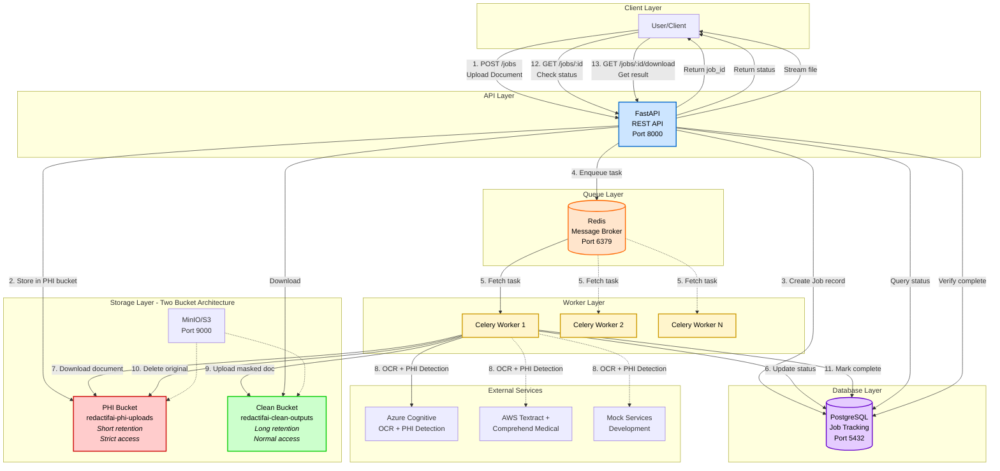

# RedactifAI

HIPAA-compliant document de-identification service that automatically detects and redacts Protected Health Information (PHI) from scanned medical documents.

## Features

- **Automated PHI Detection**: Uses OCR and ML-based entity recognition to identify 18+ categories of sensitive information
- **Multiple Masking Levels**: 
  - Safe Harbor (full de-identification)
  - Limited Dataset (preserves certain provider/organization info)
  - Custom (mask only specified categories)
- **Multi-Provider Support**: Works with Azure Cognitive Services or AWS Comprehend Medical
- **Format Support**: Process TIFF and PDF documents
- **Asynchronous Processing**: Job queue with status tracking and retry logic
- **Two-Bucket Architecture**: Separates PHI documents from de-identified outputs for compliance
- **REST API**: Submit documents via HTTP, poll for status, download results

## Quick Start

**Prerequisites:**
- Docker and Docker Compose
- Git

**Run locally:**

```bash
# Clone repository
git clone https://github.com/ssgrummons/redactifai.git
cd redactifai

# Start all services
docker-compose up --build

# API available at: http://localhost:8000
# MinIO console at: http://localhost:9001 (minioadmin / minioadmin123)
```

That's it. The system will:
1. Start PostgreSQL, Redis, and MinIO (S3-compatible storage)
2. Create PHI and clean storage buckets
3. Run database migrations
4. Start the API server and Celery workers

## API Usage

**Submit a document for de-identification:**

```bash
curl -X POST http://localhost:8000/api/v1/jobs \
  -F "file=@medical_record.tiff" \
  -F "masking_level=safe_harbor"
```

Response:
```json
{
  "job_id": "abc123...",
  "status": "pending",
  "created_at": "2025-10-01T12:00:00Z"
}
```

**Check job status:**

```bash
curl http://localhost:8000/api/v1/jobs/abc123...
```

**Download de-identified document:**

```bash
curl -O http://localhost:8000/api/v1/jobs/abc123.../download
```

**List all jobs:**

```bash
curl http://localhost:8000/api/v1/jobs?status=complete&page=1&page_size=10
```

## Architecture



**Workflow:**
1. User uploads document via API
2. API stores document in PHI bucket, creates job, enqueues task
3. Celery worker downloads document, runs OCR + PHI detection, applies masking
4. Worker uploads masked document to clean bucket, deletes original from PHI bucket
5. User downloads de-identified document

## Configuration

All configuration via environment variables. See `docker-compose.yml` for defaults.

**Key settings:**

| Variable | Description | Default |
|----------|-------------|---------|
| `OCR_PROVIDER` | OCR provider: `azure`, `aws`, or `mock` | `mock` |
| `PHI_PROVIDER` | PHI provider: `azure`, `aws`, or `mock` | `mock` |
| `DEFAULT_MASKING_LEVEL` | Default masking level | `safe_harbor` |
| `MAX_FILE_SIZE_MB` | Maximum upload size | `50` |
| `CELERY_TASK_MAX_RETRIES` | Retry failed jobs N times | `3` |
| `STORAGE_BACKEND` | Storage type: `s3` or `local` | `s3` |

**For production with Azure:**
```bash
OCR_PROVIDER=azure
PHI_PROVIDER=azure
AZURE_DOCUMENT_INTELLIGENCE_ENDPOINT=https://...
AZURE_DOCUMENT_INTELLIGENCE_KEY=...
AZURE_LANGUAGE_ENDPOINT=https://...
AZURE_LANGUAGE_KEY=...
```

**For production with AWS:**
```bash
OCR_PROVIDER=aws
PHI_PROVIDER=aws
AWS_ACCESS_KEY_ID=...
AWS_SECRET_ACCESS_KEY=...
AWS_REGION=us-east-1
AWS_COMPREHEND_REGION=us-east-1
```

**For production with AWS and Azure:**
```bash
OCR_PROVIDER=azure
AZURE_DOCUMENT_INTELLIGENCE_ENDPOINT=https://...
AZURE_DOCUMENT_INTELLIGENCE_KEY=...
PHI_PROVIDER=aws
AWS_ACCESS_KEY_ID=...
AWS_SECRET_ACCESS_KEY=...
AWS_REGION=us-east-1
AWS_COMPREHEND_REGION=us-east-1
```

## Development

**Install dependencies:**

```bash
poetry install
```

**Run tests:**

```bash
# Unit tests (fast)
poetry run pytest tests/unit -v

# Integration tests
poetry run pytest tests/integration -v

# All tests with coverage
poetry run pytest --cov=src --cov-report=html
```

**Database migrations:**

```bash
# Generate migration after model changes
poetry run alembic revision --autogenerate -m "description"

# Apply migrations
poetry run alembic upgrade head

# Rollback one migration
poetry run alembic downgrade -1
```

**Run API locally (without Docker):**

```bash
# Start dependencies
docker-compose up -d postgres redis minio

# Set environment variables
export DB_USER=redactifai
export DB_PASSWORD=redactifai_password
export DB_HOST=localhost
export DB_PORT=5432
export DB_NAME=redactifai
export CELERY_BROKER_URL=redis://localhost:6379/0
export STORAGE_BACKEND=s3
export STORAGE_S3_ENDPOINT_URL=http://localhost:9000
export OCR_PROVIDER=mock
export PHI_PROVIDER=mock

# Run migrations
poetry run alembic upgrade head

# Start API
poetry run uvicorn src.api.main:app --reload

# Start worker (separate terminal)
poetry run celery -A src.tasks worker --loglevel=info
```

## HIPAA Compliance Notes

**This system provides technical de-identification capabilities but does not guarantee HIPAA compliance on its own.**

Requirements for HIPAA compliance:
- Sign Business Associate Agreements (BAA) with cloud providers (Azure/AWS)
- Implement access controls and authentication (NoOp auth included for development only)
- Configure audit logging for all PHI access
- Set appropriate bucket lifecycle policies (PHI bucket: delete after processing, Clean bucket: retain per policy)
- Conduct privacy impact assessment and risk analysis
- Establish breach notification procedures

Safe Harbor de-identification removes 18 identifier categories but requires expert determination if quasi-identifiers remain.

## Storage Buckets

The system uses two separate storage buckets:

- **PHI Bucket** (`redactifai-phi-uploads`): Stores uploaded documents containing PHI
  - Short retention (deleted immediately after successful processing)
  - Strict access controls recommended
  - Should have aggressive lifecycle policies in production

- **Clean Bucket** (`redactifai-clean-outputs`): Stores de-identified documents
  - Long retention
  - Normal access controls
  - Can be backed up and distributed per institutional policies

This separation allows different security policies and access patterns for each bucket type.

## Extending Authentication

The included `NoOpAuth` allows all requests (development only). For production:

1. Implement a new auth class in `src/api/auth.py`:

```python
class APIKeyAuth(SecurityScheme):
    def __init__(self, valid_keys: set[str]):
        self.valid_keys = valid_keys
    
    async def verify(self, request: Request) -> bool:
        api_key = request.headers.get("X-API-Key")
        if not api_key or api_key not in self.valid_keys:
            raise HTTPException(401, "Invalid API key")
        return True
```

2. Update `src/api/dependencies.py`:

```python
def get_current_auth() -> SecurityScheme:
    return APIKeyAuth(valid_keys=settings.API_KEYS)
```

The abstraction supports API keys, JWT, mTLS, or any custom scheme.

## License

MIT License

## Support

For issues, feature requests, or questions, please open an issue on GitHub.

## Acknowledgments

Built with:
- FastAPI for REST API
- Celery for async task processing
- Azure Cognitive Services / AWS Comprehend Medical for PHI detection
- PostgreSQL for job tracking
- MinIO for S3-compatible storage